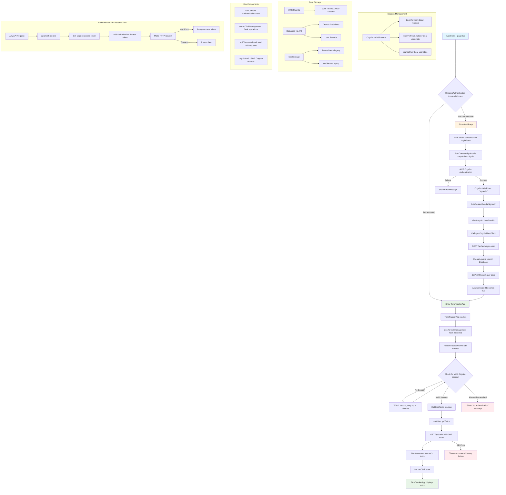
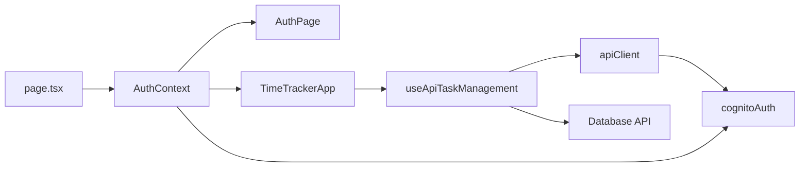

# Time Tracker App: Login Process and Task Retrieval Flow

## Complete Authentication and Data Loading Flow

## Detailed Step-by-Step Flow

### 1. Application Initialization
- **Entry Point**: `src/app/page.tsx`
- **Check**: `useAuth().isAuthenticated`
- **Routes**: AuthPage (login) or TimeTrackerApp (main app)

### 2. Authentication Process

#### Login Sequence:
1. User enters credentials in `LoginForm`
2. `AuthContext.signIn()` → `cognitoAuth.signIn()`
3. AWS Cognito validates credentials
4. **Success**: Hub event 'signedIn' fired
5. `handleSignedIn()` → get user details
6. `syncCognitoUserClient()` → POST `/api/auth/sync-user`
7. User created/updated in database
8. `AuthContext.user` state set
9. `isAuthenticated` becomes `true`

#### Session Management:
- **Hub Listeners**: Monitor auth state changes
- **Token Refresh**: Automatic JWT renewal
- **Session Validation**: `cognitoAuth.hasValidSession()`

### 3. Task Loading Process

#### Initialization Sequence:
1. `TimeTrackerApp` component mounts
2. `useApiTaskManagement` hook initializes
3. `initializeTasksWhenReady()` waits for auth
4. Polls for valid Cognito session (max 10 attempts)
5. **Once authenticated**: `loadTasks()` called
6. `apiClient.getTasks()` → GET `/api/tasks`
7. JWT token automatically added to request
8. Database returns user's task tree
9. `rootTask` state updated
10. UI displays tasks

#### Error Handling:
- **Loading State**: Shows spinner while loading
- **Auth Timeout**: Max 10 seconds wait for auth
- **API Errors**: Retry button and error messages
- **Session Expiry**: Automatic token refresh

### 4. Data Storage Architecture

#### AWS Cognito:
- User authentication and session management
- JWT tokens for API authorization
- User pool with email/username login

#### Database (via API):
- User records synced from Cognito
- Task hierarchy and daily data
- Time tracking information

#### localStorage (Legacy):
- Teams data (still used)
- userName setting (fallback)
- Originally stored all data, now mostly migrated to API

### 5. Key Technical Details

#### Authentication Flow:
- Uses AWS Amplify Auth library
- Hub event system for state changes
- Exponential backoff retry logic
- Graceful session validation

#### API Communication:
- JWT tokens in Authorization header
- Automatic token refresh
- Request retry on auth failures
- Type-safe API client

#### State Management:
- React Context for auth state
- Custom hooks for task management
- Loading and error states
- SSR-safe localStorage access

## Component Relationships

This architecture provides a robust, scalable authentication and data loading system with proper error handling, retry logic, and session management.